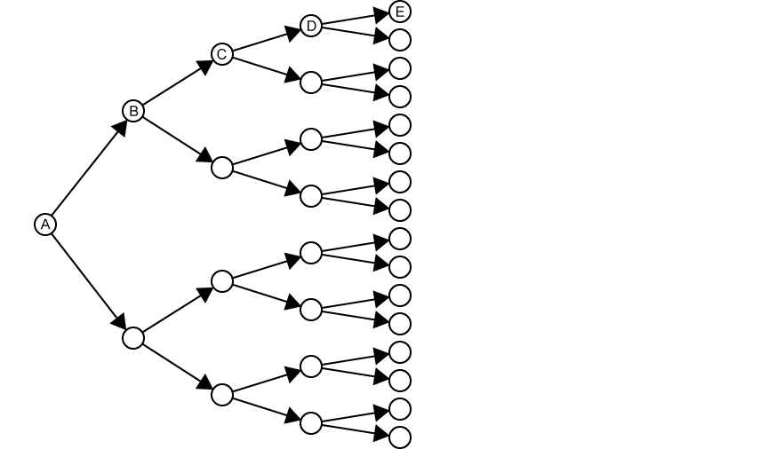
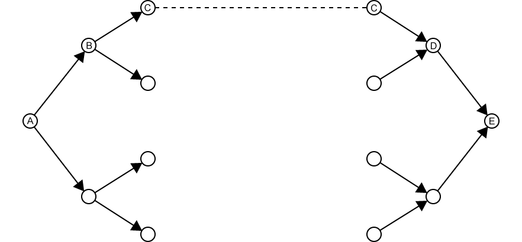
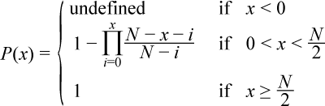

# Wikimash

An online tool that uses the [MediaWiki API][mwapi] to solve the
[Wiki Game][wikigame].

## Try it out online!

[**Live Demo on Github Pages**][demo]

### A brief description of the Wiki Game

For the uninitiated, the Wiki Game is a simple game that can be played using only
your web browser and a connection to [Wikipedia][wikipedia]. The player begins
with two Wikipedia articles, a start article and an end article. The goal of the
game is to begin at the start article then, using only hyperlinks found in
wikipedia articles, navigate from one page to another to find the end article.
For example, if start article was *Hydrogen*  and the end article was *Penguin*
your path may something look like: `Hydrogen > Algae > Marine biology > Penguin`

## How it works

### The Goal

Given two Wikipedia articles, a start and an end, find a path between them by
following hyperlinks from the start article to the end using the minimum number
of MediaWiki API requests possible.

### The Problem

We are essentially navigating a maze with no sense of direction. Unlike other
pathfinding problems, we can't really get an idea of how far we have yet to go
to reach the end. In a traditional maze we could use the distance as the crow
flies as a heuristic to help guide the algorithm, but we don't have that luxury
in this case.

### The Wrong Approach

One option is to do a simple [breadth-first search][bfs] from start article
until you find the end article. Now, if a relatively short path between the
start and end articles exists this wouldn't be a terrible option. But, in the
likely scenario where there are more than a couple articles between start and
end, this method will take absolutely forever due to the exponentially increasing
number of articles that must be explored as you go deeper and deeper in the
search tree with no end insight.

### A Solution

A way to solve this problem is to perform a [bidirectional search][bds].
Meaning, instead of only having one search tree that tries to explore from start
to end, we should use two search trees. The first will be a traditional forward
search tree that begins at the start article and follows links to expand the
tree. The second will be a backwards search tree which starts at the end article
and follows [backlinks][backlink] (as oppose traditional forward links) to
expand the tree. As we simultaneously explore both trees, if at any point we
find an article shared between the two trees we instantly know that we have
found a path from start and end. To complete the path we simply trace the shared
article back to the root article in both trees. The root article in the forward
search tree is the start and conversely the root article on the backward search
tree is the end. Thus we have our path.

### How Viable is this Theoretically?

Statistically, given two search trees, each containing *x* unique articles the
likelihood of them sharing article at least one article given a pool of *N*
articles is given by:

There are approximately 6 million English Wikipedia articles at the time of
writing this. We will let that be our the size of our article pool *N* and graph
that probability function:

So, given roughly 3000 unique randomly-selected articles per search tree (6000
articles total) there is 75% a path will have been found. Currently, the
MediaWiki [Links API][mwapilinks] and [Linkshere API][mwapilinkshere] both
impose a 500 articles returned per request limit. Meaning that it would take at
least 12 requests to accrue 6000 articles. Following the
[MediaWiki API Etiquette][mwapietiquette], meaning no parallel/concurrent
requests, assuming a 150ms round-trip time for API requests, after 1.8 seconds
there would be a 75% chance a path has been found. Using the same logic, 2.4
seconds of searching would give a roughly 95% chance.

### How Viable is this Practically?

There are a few key factors that make the efficiency of the algorithm deviate
from the previously described model. Below are some crude observations I made
when testing the program.

#### Disparity in the Interconnectedness of Articles

Generally, articles on Wikipedia are quite well connected. When an article is
created usually writers will populate the page with at least a few links to
broader topics. This is extremely beneficial to us and can even make the
algorithm perform better than the above model. Unfortunately, while this case
almost always holds for traditional forward links, it is not so simple for
backlinks. When an article is created sadly it is not always a priority to link
to them, meaning that small articles that are relatively narrow in subject
matter sometimes either have no articles that link to them or only have very
few similarly obscure and disconnected articles that link to them.

#### When Does the Algorithm Fail?

The only scenario in which the algorithm fails is when there is no possible path
from the start to end. This is determined to be the case when one of the two
search trees runs out of articles to explore. This is quite a rare occurrence. I
have never observed it happening in the forward search tree. And the only time
it has happened in the backward search tree is when the end article is extremely
obscure an disconnected.

#### When Does the Algorithm Take a Long Time?

The most common situation where the algorithm stalls is when it gets trapped in
a group of articles that have a large number of connections to similar articles
without with few connections to broader topics. This, much like the fail scenario
is relatively rare. The only articles I've seen exhibit this are some 'List of
[Insert Topic]' articles that have an absurd number of links but no broader
topics linked. 

[wikipedia]:https://wikipedia.org/
[demo]:https://luctowers.github.io/wikimash
[mwapi]:https://www.mediawiki.org/wiki/API:Main_page
[mwapietiquette]:https://www.mediawiki.org/wiki/API:Etiquette
[mwapilinks]:https://www.mediawiki.org/wiki/API:Links
[mwapilinkshere]:https://www.mediawiki.org/wiki/API:Linkshere
[wikigame]:https://en.wikipedia.org/wiki/Wikipedia:Wiki_Game
[bfs]:https://en.wikipedia.org/wiki/Breadth-first_search
[bds]:https://en.wikipedia.org/wiki/Bidirectional_search
[backlink]:https://en.wikipedia.org/wiki/Backlink
